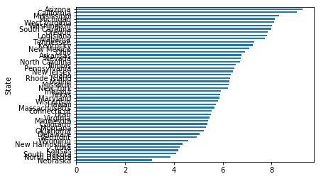
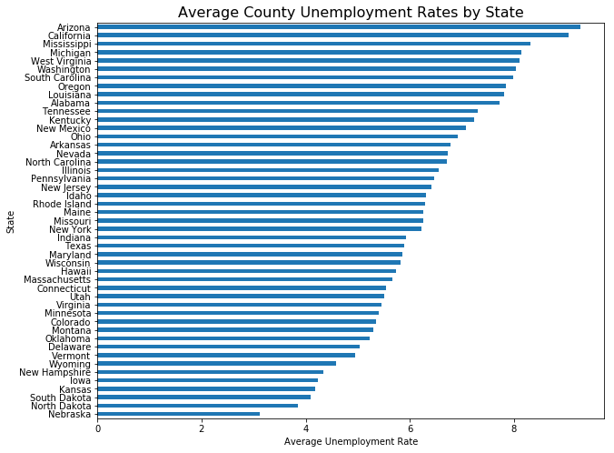
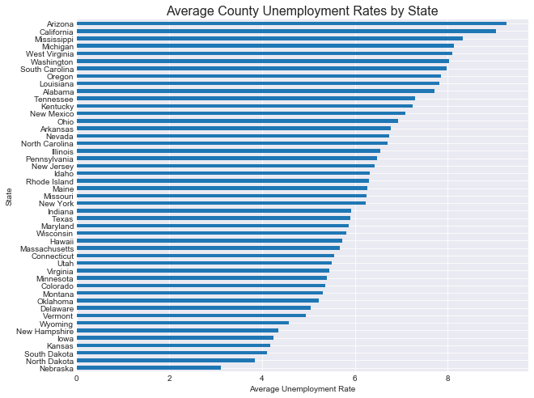
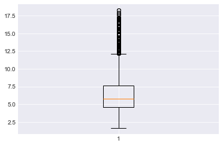
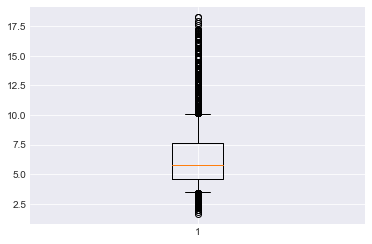
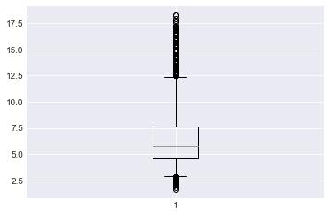
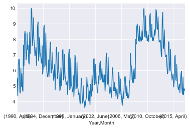

```python
import pandas as pd
import matplotlib.pyplot as plt
import seaborn as sns
%matplotlib inline
```


```python
df = pd.read_csv('output.csv')
print(len(df))
df.head()
```

    885548


<div>
<style>
    .dataframe thead tr:only-child th {
        text-align: right;
    }

    .dataframe thead th {
        text-align: left;
    }

    .dataframe tbody tr th {
        vertical-align: top;
    }
</style>
<table border="1" class="dataframe">
  <thead>
    <tr style="text-align: right;">
      <th></th>
      <th>Year</th>
      <th>Month</th>
      <th>State</th>
      <th>County</th>
      <th>Rate</th>
    </tr>
  </thead>
  <tbody>
    <tr>
      <th>0</th>
      <td>2015</td>
      <td>February</td>
      <td>Mississippi</td>
      <td>Newton County</td>
      <td>6.1</td>
    </tr>
    <tr>
      <th>1</th>
      <td>2015</td>
      <td>February</td>
      <td>Mississippi</td>
      <td>Panola County</td>
      <td>9.4</td>
    </tr>
    <tr>
      <th>2</th>
      <td>2015</td>
      <td>February</td>
      <td>Mississippi</td>
      <td>Monroe County</td>
      <td>7.9</td>
    </tr>
    <tr>
      <th>3</th>
      <td>2015</td>
      <td>February</td>
      <td>Mississippi</td>
      <td>Hinds County</td>
      <td>6.1</td>
    </tr>
    <tr>
      <th>4</th>
      <td>2015</td>
      <td>February</td>
      <td>Mississippi</td>
      <td>Kemper County</td>
      <td>10.6</td>
    </tr>
  </tbody>
</table>
</div>


```python
df.info()
```

    <class 'pandas.core.frame.DataFrame'>
    RangeIndex: 885548 entries, 0 to 885547
    Data columns (total 5 columns):
    Year      885548 non-null int64
    Month     885548 non-null object
    State     885548 non-null object
    County    885548 non-null object
    Rate      885548 non-null float64
    dtypes: float64(1), int64(1), object(3)
    memory usage: 33.8+ MB


# The .groupby() and .plot() methods


```python
state_avg = df.groupby('State')['Rate'].mean() #Aggregate the data
state_avg = state_avg.sort_values() #Sort the Aggregation
state_avg.head() #Preview the series
```


    State
    Nebraska        3.109903
    North Dakota    3.848084
    South Dakota    4.097629
    Kansas          4.178851
    Iowa            4.236744
    Name: Rate, dtype: float64


```python
#Create a bar graph from the series
state_avg.plot(kind='barh')
```


    <matplotlib.axes._subplots.AxesSubplot at 0x1e8269b0c88>





# Controlling Figure Asthetics with plt methods

### Recall that plt is the standard alias for the pyplot submodule of matplotlib 
`import matplotlib.pyplot as plt`


```python
plt.figure(figsize=(10,8)) #Manually creates a figure object and specifies the size (will be useful for subplots later too)
state_avg.plot(kind='barh') #Same Visual code as before
plt.title('Average County Unemployment Rates by State', fontsize=16)
plt.xlabel('Average Unemployment Rate') #Add Axis Label (y already labelled)
```


    <matplotlib.text.Text at 0x1e826f139e8>





# Seaborn
Again seaborn can also improve the asthetics of our visual.


```python
import seaborn as sns
```


```python
sns.set_style('darkgrid')
```


```python
#Same code as above 

plt.figure(figsize=(10,8)) #Manually creates a figure object and specifies the size (will be useful for subplots later too)
state_avg.plot(kind='barh') #Same Visual code as before
plt.title('Average County Unemployment Rates by State', fontsize=16)
plt.xlabel('Average Unemployment Rate') #Add Axis Label (y already labelled)
```


    <matplotlib.text.Text at 0x1e82739b0f0>





# Box [and whisker] Plots


```python
ny_rates = df[df.State=='New York'].Rate
print(len(ny_rates), type(ny_rates), ny_rates[:5])
```

    20088 <class 'pandas.core.series.Series'> 2453    6.6
    2454    6.9
    2455    5.8
    2456    8.1
    2457    7.4
    Name: Rate, dtype: float64


```python
plt.boxplot(list(ny_rates))
```


    {'boxes': [<matplotlib.lines.Line2D at 0x1e8282862b0>],
     'caps': [<matplotlib.lines.Line2D at 0x1e8282a8710>,
      <matplotlib.lines.Line2D at 0x1e8282a8d68>],
     'fliers': [<matplotlib.lines.Line2D at 0x1e827739a58>],
     'means': [],
     'medians': [<matplotlib.lines.Line2D at 0x1e8282a8eb8>],
     'whiskers': [<matplotlib.lines.Line2D at 0x1e828286a20>,
      <matplotlib.lines.Line2D at 0x1e828286b70>]}





# The Rectanbular Box
The rectangular box of the box and whisker plot is bounded by the 25th percentile at the bottom, the 75th percentile at the top and the median, the colored line in the middle.

# The Median 
The median is the middle data point in the data; half of the other data points are above it and half of the data points are below it.


```python
#The center line above (currently orange) is the median.
ny_rates.median()
```


    5.8


# Quartiles and Percentiles
The top and bottom of the middle rectangle surrounding the median are the upper and lower quartiles
These are also known as the 25th percentile and the 75th percentile. They can also be thought of the median of the lower half of the data and the median of the upper half of the data.
    * 25% of the data falls between the minimum and the 25th percentile
    * 25% of the data falls between the 25th percentile and the median
    * 25% of the data falls between the median and the 75th percentile
    * 25% of the data falls between the 75th percentile and the maximum


```python
print('25th percentile:', ny_rates.quantile(q=.25))
print('75th percentile:', ny_rates.quantile(q=.75))
```

    25th percentile: 4.6
    75th percentile: 7.6


# Whiskers
The whiskers of the box and whisker plot can be specified in a couple of different manners.  
Here's the notes from the docstring (which is also good practice for reading documentation)!

whis : float, sequence, or string (default = 1.5)

    As a float, determines the reach of the whiskers to the beyond the first and third quartiles. In other words, where IQR is the interquartile range (Q3-Q1), the upper whisker will extend to last datum less than Q3 + whis*IQR). Similarly, the lower whisker will extend to the first datum greater than Q1 - whis*IQR. Beyond the whiskers, data are considered outliers and are plotted as individual points. Set this to an unreasonably high value to force the whiskers to show the min and max values. Alternatively, set this to an ascending sequence of percentile (e.g., [5, 95]) to set the whiskers at specific percentiles of the data. Finally, whis can be the string 'range' to force the whiskers to the min and max of the data.


```python
#Remember you can pull up the full docstring
plt.boxplot?
```


```python
plt.boxplot(list(ny_rates), whis=[5,95]) #Whiskers are now set to 5th and 95th percentile rather then outlier metric
```


    {'boxes': [<matplotlib.lines.Line2D at 0x1e82df69240>],
     'caps': [<matplotlib.lines.Line2D at 0x1e82df62cc0>,
      <matplotlib.lines.Line2D at 0x1e82df62eb8>],
     'fliers': [<matplotlib.lines.Line2D at 0x1e82df9bf98>],
     'means': [],
     'medians': [<matplotlib.lines.Line2D at 0x1e82df9b748>],
     'whiskers': [<matplotlib.lines.Line2D at 0x1e82df69be0>,
      <matplotlib.lines.Line2D at 0x1e82df69e10>]}





```python
plt.boxplot(list(ny_rates), whis=[1,99]) #Whiskers are now set to 1st and 99th percentile rather then outlier metric
```


    {'boxes': [<matplotlib.lines.Line2D at 0x1e82df24940>],
     'caps': [<matplotlib.lines.Line2D at 0x1e82812bda0>,
      <matplotlib.lines.Line2D at 0x1e82812bef0>],
     'fliers': [<matplotlib.lines.Line2D at 0x1e828132be0>],
     'means': [],
     'medians': [<matplotlib.lines.Line2D at 0x1e828132588>],
     'whiskers': [<matplotlib.lines.Line2D at 0x1e82df24b38>,
      <matplotlib.lines.Line2D at 0x1e82812b748>]}





# Removing points above and below the whiskers


```python
plt.boxplot(list(ny_rates), whis=[5,95], showfliers=False) #Do not display points above/below whiskers
```


    {'boxes': [<matplotlib.lines.Line2D at 0x1e828c47d30>],
     'caps': [<matplotlib.lines.Line2D at 0x1e828c557f0>,
      <matplotlib.lines.Line2D at 0x1e828c55fd0>],
     'fliers': [],
     'means': [],
     'medians': [<matplotlib.lines.Line2D at 0x1e828c5b278>],
     'whiskers': [<matplotlib.lines.Line2D at 0x1e828c47f28>,
      <matplotlib.lines.Line2D at 0x1e828c4ef60>]}


# Some other measures


```python
ny_rates.min()
```


    1.6000000000000001


```python
ny_rates.max()
```


    18.300000000000001


```python
ny_rates.quantile(q=.1)
```


    3.8


```python
ny_rates.quantile(q=.9)
```


    9.1


# Graphing Time Data


```python
ny = df[df.State == 'New York']
ny.head(2)
```


<div>
<style>
    .dataframe thead tr:only-child th {
        text-align: right;
    }

    .dataframe thead th {
        text-align: left;
    }

    .dataframe tbody tr th {
        vertical-align: top;
    }
</style>
<table border="1" class="dataframe">
  <thead>
    <tr style="text-align: right;">
      <th></th>
      <th>Year</th>
      <th>Month</th>
      <th>State</th>
      <th>County</th>
      <th>Rate</th>
    </tr>
  </thead>
  <tbody>
    <tr>
      <th>2453</th>
      <td>2015</td>
      <td>February</td>
      <td>New York</td>
      <td>Livingston County</td>
      <td>6.6</td>
    </tr>
    <tr>
      <th>2454</th>
      <td>2015</td>
      <td>February</td>
      <td>New York</td>
      <td>Wayne County</td>
      <td>6.9</td>
    </tr>
  </tbody>
</table>
</div>


```python
ny_monthly = ny.groupby(['Year', 'Month'])['Rate'].mean()
ny_monthly.head(2)
```


    Year  Month 
    1990  April     5.470968
          August    4.350000
    Name: Rate, dtype: float64


```python
ny_monthly.plot()
```


    <matplotlib.axes._subplots.AxesSubplot at 0x1e82782f3c8>





# Practice Controlling Figure Asthetics
Use plt methods like .figure(), .title(), and .ylabel() to improve upon the simple time plot shown above.


```python
# Your code here
```
